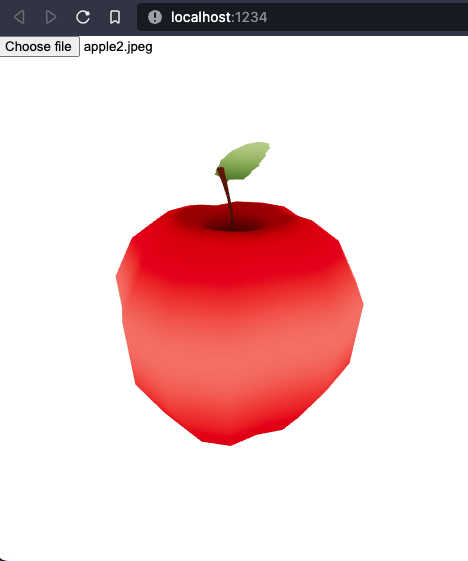

# Fruit detector
Detect fruits on img and render on canvas based on Yolo and Three.js

# frontend
```cmd
yarn install
yarn dev
```

# backend
```cmd
python -m venv venv
source venv/bin/activate
pip install -r requirements.txt
python main.py
```

