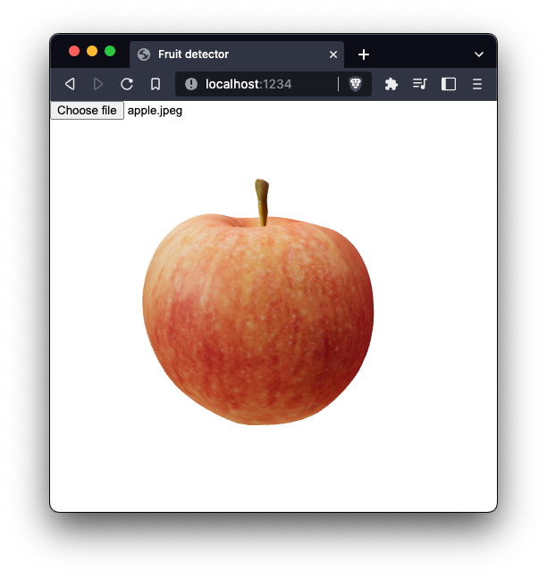

# Fruit detector
Detect fruits on img and render on canvas based on Yolo and Three.js.

# frontend
```cmd
yarn install
yarn dev
```

# backend

## setup curom model
if you want to load your prediction model you have to replace this file or modify loader in main file
`models/best.pt`

## start server
```cmd
python -m venv venv
source venv/bin/activate
pip install -r requirements.txt
python main.py
```




# credits
##
fruit detection [model](https://github.com/00011010z/fruit-detection-MGABO) by [张灿](https://github.com/00011010z)
## 3d models
Creative commons models from sketchfab


